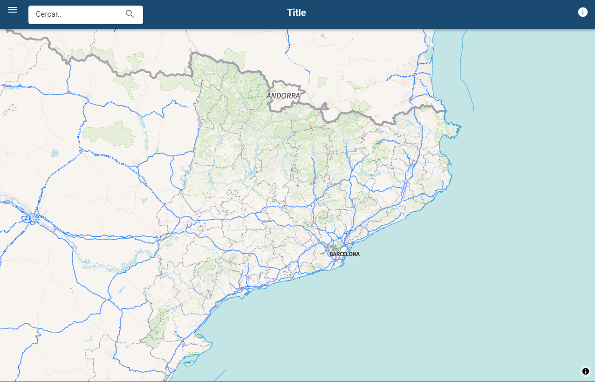

# Map Viewer svelte template app

Based on template for [Svelte](https://svelte.dev) apps. It lives at https://github.com/sveltejs/template.

Composed:

    * UI Material from https://github.com/hperrin/svelte-material-ui

    * MapBox GL JS from https://docs.mapbox.com/mapbox-gl-js/api/ 

    * ContextMaps Vector Tiles (https://openicgc.github.io/)

*Note that you will need to have [Node.js](https://nodejs.org) installed.*



## Get started

Install the dependencies...

```bash
cd svelte-app
npm install
```

...then start [Rollup](https://rollupjs.org):

```bash
npm run dev
```

Navigate to [localhost:5000](http://localhost:5000). You should see your app running. Edit a component file in `src`, save it, and reload the page to see your changes.

By default, the server will only respond to requests from localhost. To allow connections from other computers, edit the `sirv` commands in package.json to include the option `--host 0.0.0.0`.


## Building and running in production mode

To create an optimised version of the app:

```bash
npm run build
```

You can run the newly built app with `npm run start`. This uses [sirv](https://github.com/lukeed/sirv), which is included in your package.json's `dependencies` so that the app will work when you deploy to platforms like [Heroku](https://heroku.com).

